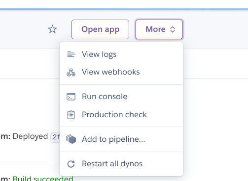

## PROJO

## Author
MACRINE ALICE ADHIAMBO "ALICIA"[https://github.com/Alicia-krynne]

## Description
PROJO is a web app where users can  upload their projects and have them reviewed  by their peers. 

## PROJECT MOCK-UP
FIGMA[https://www.figma.com/file/lMFBNqX8kTDnAcoBJsdMjD/IP-3-PROJO?node-id=0%3A1]

### ACESSING THE  ADMIN PAGE 
1. Create a super user localy using the command (python3 manage.py createsuperuser)
2. Then on the browser access the admin dashboard using the link [http://127.0.0.1:8000/admin]
3. add the  images using these site to  vies them on the browser

To access the admin page on heroku,navigate to the more section and choose runcosole as shown below and follow the steps above

## SCREENSHOTS  OF THE PAGE 
### 1.TESTS RUN 

### 2.  SIGNING IN 

### 3. HOMEPAGE 

### 4. PROFILE PAGE 

### 5.PROJECT PAGE  

### 6. ADDING A PROJECT

### 7.RESPONSIVE PAGE  

## CLONNG THE  REPOSITORY:
https://github.com/Alicia-krynne/project-review
Move to the folder and install requirements
pip install -r requirements.txt (to  install dependecies)
Exporting Configurations
Running the application
python3 manage.py runserver
Testing the application
python3 manage.py test
to  run  the  admin page , run python3 createsuperuser and  create new  admin  credentials

## TECHNOLOGIES
1. Python :This is the main language in this project to create the methods and funtions needed. 
2. HTML: for creating the pages that are in the web app. also using HTML to manipulate the display. 
3. css : this is the styling language used for this app. Bootsrap is also added to make styling more efficient. 
4. shell&powershell : used to combine the flexibility of scripting, command-line speed, and the power of a GUI-based admin tool, in this case for our app.
5. Heroku :  for deploying the  app 

### Current Bugs:
displaying the  ratings is  till under process

## Contact Information
If you have any question or contributions, please email me at [alicakryne@outlook.com]

## License
MIT License:
Copyright (c) 2021 Macrine Alice Adhiambo
